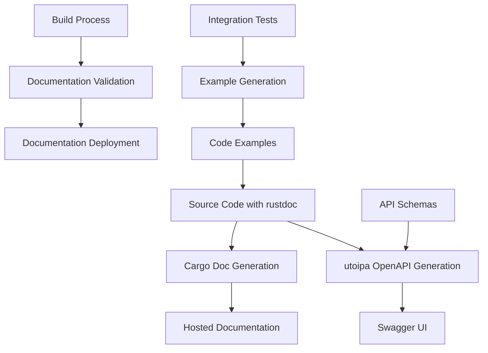

# Design Document

## Overview

This design outlines the implementation of comprehensive API documentation for the kitchen management system. The system already has basic OpenAPI integration with `utoipa` and `utoipa-swagger-ui`, but needs significant expansion to cover all endpoints, provide comprehensive examples, and establish a maintainable documentation workflow.

The design focuses on leveraging Rust's existing documentation ecosystem while adding kitchen management-specific examples and workflows. The solution will provide both inline rustdoc documentation and interactive OpenAPI/Swagger documentation.

## Architecture

### Documentation Generation Flow



### Current State Analysis

**Existing Components:**
- `utoipa` for OpenAPI generation (v4.0.0)
- `utoipa-swagger-ui` for interactive documentation (v4.0.0)
- Basic OpenAPI paths for auth endpoints (`register`, `login`)
- Swagger UI available at `/swagger-ui`
- OpenAPI spec served at `/api-docs/openapi.json`

**Missing Components:**
- Comprehensive rustdoc comments for all public APIs
- Complete OpenAPI coverage for all endpoints
- Code examples and usage patterns
- Documentation build automation
- Kitchen management-specific workflow examples

## Components and Interfaces

### 1. Rustdoc Documentation Enhancement

**Component**: Inline Documentation System
**Location**: Throughout `src/` modules

**Interface Design:**
```rust
/// Kitchen Management API for menu operations
/// 
/// This module provides comprehensive menu management functionality including
/// CRUD operations, category management, and inventory integration.
/// 
/// # Examples
/// 
/// ## Creating a new menu item
/// 
/// ```rust
/// use kitchen_api::menu::{MenuItem, MenuCategory};
/// 
/// let item = MenuItem {
///     name: "Grilled Salmon".to_string(),
///     category: MenuCategory::MainCourse,
///     price: 24.99,
///     ingredients: vec!["salmon", "lemon", "herbs"],
///     allergens: vec!["fish"],
/// };
/// ```
/// 
/// ## Kitchen workflow integration
/// 
/// ```rust
/// // Order received -> Kitchen preparation
/// let order = Order::new(vec![item]);
/// kitchen_service.prepare_order(order).await?;
/// ```
pub mod menu;
```

**Documentation Standards:**
- All public functions must have `///` documentation
- Include parameter descriptions with types
- Provide return value documentation
- Document error conditions
- Include practical examples
- Reference related functions/modules

### 2. OpenAPI Schema Expansion

**Component**: Comprehensive OpenAPI Documentation
**Location**: `src/docs.rs` and throughout API modules

**Current Schema Structure:**
```rust
#[derive(OpenApi)]
#[openapi(
    paths(
        crate::api::auth::register,
        crate::api::auth::login,
        // Missing: user endpoints, health endpoints, future kitchen endpoints
    ),
    components(
        schemas(
            crate::core::auth::RegisterRequest,
            crate::core::auth::LoginRequest,
            crate::api::auth::TokenResponse,
            // Missing: User schemas, error responses, kitchen management schemas
        )
    ),
    tags(
        (name = "auth", description = "Authentication endpoints"),
        // Missing: user, health, kitchen management tags
    )
)]
pub struct ApiDoc;
```

**Enhanced Schema Design:**
```rust
#[derive(OpenApi)]
#[openapi(
    info(
        title = "Kitchen Management API",
        version = "1.0.0",
        description = "Comprehensive restaurant kitchen management system API",
        contact(
            name = "Kitchen Management Team",
            email = "api@kitchenmanagement.com"
        ),
        license(
            name = "MIT",
            url = "https://opensource.org/licenses/MIT"
        )
    ),
    servers(
        (url = "/api/v1", description = "Production API"),
        (url = "http://localhost:3000/api/v1", description = "Development API")
    ),
    paths(
        // Authentication
        crate::api::auth::register,
        crate::api::auth::login,
        crate::api::auth::refresh,
        
        // User Management
        crate::api::user::create_user,
        crate::api::user::get_user,
        crate::api::user::get_current_user,
        crate::api::user::get_current_user_stats,
        crate::api::user::update_user,
        crate::api::user::delete_user,
        
        // Health Checks
        crate::api::health::live,
        crate::api::health::ready,
        
        // Refresh Tokens
        crate::api::refresh_token::create_refresh_token,
        crate::api::refresh_token::get_refresh_token,
        crate::api::refresh_token::update_refresh_token,
        crate::api::refresh_token::delete_refresh_token,
    ),
    components(
        schemas(
            // Authentication schemas
            crate::core::auth::RegisterRequest,
            crate::core::auth::LoginRequest,
            crate::api::auth::TokenResponse,
            crate::api::auth::ErrorResponse,
            crate::api::auth::AuthError,
            
            // User schemas
            crate::core::user::User,
            crate::api::user::UserInfoWithStats,
            
            // Validation schemas
            crate::middleware::validation::ValidationErrorResponse,
            crate::middleware::validation::ValidationError,
        ),
        security_schemes(
            ("bearer_auth" = SecurityScheme::Http(
                HttpBuilder::new()
                    .scheme(HttpAuthScheme::Bearer)
                    .bearer_format("JWT")
                    .description(Some("JWT token for authentication"))
                    .build()
            ))
        )
    ),
    tags(
        (name = "authentication", description = "User authentication and authorization"),
        (name = "users", description = "User management operations"),
        (name = "health", description = "System health and monitoring"),
        (name = "tokens", description = "Refresh token management"),
    ),
    external_docs(
        url = "/docs",
        description = "Additional API documentation and guides"
    )
)]
pub struct ApiDoc;
```

### 3. Code Examples and Usage Patterns

**Component**: Practical Examples Library
**Location**: `examples/` directory and inline documentation

**Example Structure:**
```
examples/
├── authentication/
│   ├── basic_auth.rs
│   ├── jwt_refresh.rs
│   └── role_based_access.rs
├── user_management/
│   ├── user_crud.rs
│   ├── user_stats.rs
│   └── profile_management.rs
├── kitchen_workflows/
│   ├── order_processing.rs
│   ├── menu_management.rs
│   └── inventory_tracking.rs
└── integration/
    ├── full_workflow.rs
    ├── error_handling.rs
    └── rate_limiting.rs
```

**Example Implementation:**
```rust
//! # Kitchen Management API Examples
//! 
//! This module provides comprehensive examples for common kitchen management workflows.

/// Complete user authentication flow
/// 
/// Demonstrates registration, login, token refresh, and authenticated requests.
pub mod authentication {
    use serde_json::json;
    
    /// Register a new user and obtain authentication token
    /// 
    /// # Example
    /// 
    /// ```rust
    /// use reqwest::Client;
    /// use serde_json::json;
    /// 
    /// #[tokio::main]
    /// async fn main() -> Result<(), Box<dyn std::error::Error>> {
    ///     let client = Client::new();
    ///     
    ///     // Register new user
    ///     let registration = json!({
    ///         "email": "chef@restaurant.com",
    ///         "password": "SecurePass123!",
    ///         "full_name": "Head Chef"
    ///     });
    ///     
    ///     let response = client
    ///         .post("http://localhost:3000/api/v1/auth/register")
    ///         .json(&registration)
    ///         .send()
    ///         .await?;
    ///     
    ///     let token_response: serde_json::Value = response.json().await?;
    ///     let token = token_response["token"].as_str().unwrap();
    ///     
    ///     println!("Authentication token: {}", token);
    ///     Ok(())
    /// }
    /// ```
    pub fn register_example() {}
    
    /// Login with existing credentials
    /// 
    /// # Example
    /// 
    /// ```rust
    /// let login = json!({
    ///     "email": "chef@restaurant.com",
    ///     "password": "SecurePass123!"
    /// });
    /// 
    /// let response = client
    ///     .post("http://localhost:3000/api/v1/auth/login")
    ///     .json(&login)
    ///     .send()
    ///     .await?;
    /// ```
    pub fn login_example() {}
}
```

### 4. Documentation Build Process

**Component**: Automated Documentation Generation
**Location**: Build scripts and CI/CD integration

**Build Process Design:**
```rust
// build.rs enhancement
use std::process::Command;

fn main() {
    // Existing protobuf compilation
    tonic_build::compile_protos("proto/user_stats.proto").unwrap();
    
    // Generate comprehensive documentation
    generate_api_docs();
    validate_documentation();
}

fn generate_api_docs() {
    // Generate rustdoc with examples
    let output = Command::new("cargo")
        .args(&["doc", "--no-deps", "--document-private-items"])
        .output()
        .expect("Failed to generate rustdoc");
    
    if !output.status.success() {
        panic!("Documentation generation failed: {}", String::from_utf8_lossy(&output.stderr));
    }
    
    // Validate OpenAPI spec generation
    let output = Command::new("cargo")
        .args(&["test", "--test", "openapi_validation"])
        .output()
        .expect("Failed to validate OpenAPI spec");
    
    if !output.status.success() {
        panic!("OpenAPI validation failed: {}", String::from_utf8_lossy(&output.stderr));
    }
}

fn validate_documentation() {
    // Check for missing documentation
    let output = Command::new("cargo")
        .args(&["doc", "--no-deps", "--document-private-items", "--", "-D", "missing_docs"])
        .output()
        .expect("Failed to validate documentation completeness");
    
    if !output.status.success() {
        eprintln!("Warning: Some public APIs lack documentation");
    }
}
```

## Data Models

### Documentation Metadata

```rust
/// Documentation metadata for API endpoints
#[derive(Debug, Serialize, Deserialize)]
pub struct ApiEndpointDoc {
    /// Endpoint path
    pub path: String,
    /// HTTP method
    pub method: String,
    /// Brief description
    pub summary: String,
    /// Detailed description
    pub description: String,
    /// Request examples
    pub request_examples: Vec<RequestExample>,
    /// Response examples
    pub response_examples: Vec<ResponseExample>,
    /// Related endpoints
    pub related_endpoints: Vec<String>,
    /// Kitchen workflow context
    pub workflow_context: Option<WorkflowContext>,
}

#[derive(Debug, Serialize, Deserialize)]
pub struct RequestExample {
    /// Example name
    pub name: String,
    /// Example description
    pub description: String,
    /// Request body
    pub body: serde_json::Value,
    /// Required headers
    pub headers: HashMap<String, String>,
}

#[derive(Debug, Serialize, Deserialize)]
pub struct ResponseExample {
    /// HTTP status code
    pub status: u16,
    /// Response description
    pub description: String,
    /// Response body
    pub body: serde_json::Value,
}

#[derive(Debug, Serialize, Deserialize)]
pub struct WorkflowContext {
    /// Workflow name (e.g., "Order Processing", "Menu Management")
    pub workflow: String,
    /// Step in the workflow
    pub step: String,
    /// Prerequisites
    pub prerequisites: Vec<String>,
    /// Next steps
    pub next_steps: Vec<String>,
}
```

### OpenAPI Extensions

```rust
/// Kitchen management specific OpenAPI extensions
#[derive(Debug, Serialize, Deserialize)]
pub struct KitchenApiExtensions {
    /// Kitchen workflow information
    #[serde(rename = "x-kitchen-workflow")]
    pub workflow: Option<String>,
    
    /// Required permissions
    #[serde(rename = "x-required-permissions")]
    pub permissions: Option<Vec<String>>,
    
    /// Rate limiting information
    #[serde(rename = "x-rate-limit")]
    pub rate_limit: Option<RateLimitInfo>,
    
    /// Real-time capabilities
    #[serde(rename = "x-real-time")]
    pub real_time: Option<bool>,
}

#[derive(Debug, Serialize, Deserialize)]
pub struct RateLimitInfo {
    /// Requests per minute
    pub requests_per_minute: u32,
    /// Burst allowance
    pub burst: Option<u32>,
}
```

## Error Handling

### Documentation Error Types

```rust
/// Documentation generation errors
#[derive(Debug, thiserror::Error)]
pub enum DocumentationError {
    #[error("Missing documentation for public API: {api}")]
    MissingDocumentation { api: String },
    
    #[error("Invalid OpenAPI specification: {reason}")]
    InvalidOpenApiSpec { reason: String },
    
    #[error("Example validation failed: {example} - {error}")]
    ExampleValidationFailed { example: String, error: String },
    
    #[error("Documentation build failed: {error}")]
    BuildFailed { error: String },
}

/// Documentation validation results
#[derive(Debug)]
pub struct ValidationResult {
    /// Validation success
    pub success: bool,
    /// Missing documentation items
    pub missing_docs: Vec<String>,
    /// Invalid examples
    pub invalid_examples: Vec<String>,
    /// Warnings
    pub warnings: Vec<String>,
}
```

### Error Response Documentation

```rust
/// Standardized error response documentation
impl ErrorResponse {
    /// Generate OpenAPI documentation for error responses
    pub fn openapi_examples() -> Vec<(String, serde_json::Value)> {
        vec![
            ("ValidationError".to_string(), json!({
                "error": "Validation failed",
                "details": "Invalid email format",
                "field_errors": {
                    "email": ["Must be a valid email address"]
                }
            })),
            ("AuthenticationError".to_string(), json!({
                "error": "Invalid credentials",
                "details": "Invalid email or password"
            })),
            ("RateLimitError".to_string(), json!({
                "error": "Rate limit exceeded",
                "details": "Too many requests. Try again in 60 seconds.",
                "retry_after": 60
            })),
        ]
    }
}
```

## Testing Strategy

### Documentation Testing Framework

```rust
/// Test suite for documentation validation
#[cfg(test)]
mod documentation_tests {
    use super::*;
    
    /// Validate that all public APIs have documentation
    #[test]
    fn test_all_public_apis_documented() {
        let missing_docs = find_undocumented_apis();
        assert!(
            missing_docs.is_empty(),
            "Missing documentation for: {:?}",
            missing_docs
        );
    }
    
    /// Validate OpenAPI specification
    #[test]
    fn test_openapi_spec_valid() {
        let spec = ApiDoc::openapi();
        validate_openapi_spec(&spec).expect("OpenAPI spec should be valid");
    }
    
    /// Test that all examples compile and run
    #[tokio::test]
    async fn test_examples_valid() {
        // Test authentication examples
        test_authentication_examples().await;
        
        // Test user management examples
        test_user_management_examples().await;
        
        // Test error handling examples
        test_error_handling_examples().await;
    }
    
    /// Validate that documentation examples match actual API behavior
    #[tokio::test]
    async fn test_examples_match_api() {
        let test_server = start_test_server().await;
        
        // Test each documented example against the actual API
        for example in get_all_documented_examples() {
            let result = execute_example(&test_server, &example).await;
            assert!(result.is_ok(), "Example failed: {}", example.name);
        }
    }
}

/// Integration tests for documentation endpoints
#[cfg(test)]
mod integration_tests {
    /// Test Swagger UI accessibility
    #[tokio::test]
    async fn test_swagger_ui_accessible() {
        let app = create_test_app().await;
        let response = app
            .oneshot(Request::get("/swagger-ui").body(Body::empty()).unwrap())
            .await
            .unwrap();
        
        assert_eq!(response.status(), StatusCode::OK);
    }
    
    /// Test OpenAPI spec endpoint
    #[tokio::test]
    async fn test_openapi_spec_endpoint() {
        let app = create_test_app().await;
        let response = app
            .oneshot(Request::get("/api-docs/openapi.json").body(Body::empty()).unwrap())
            .await
            .unwrap();
        
        assert_eq!(response.status(), StatusCode::OK);
        
        let body = response.into_body();
        let spec: serde_json::Value = serde_json::from_slice(&body).unwrap();
        
        // Validate spec structure
        assert!(spec["openapi"].is_string());
        assert!(spec["info"].is_object());
        assert!(spec["paths"].is_object());
    }
}
```

### Example Validation

```rust
/// Validate that code examples are correct and executable
pub struct ExampleValidator {
    client: reqwest::Client,
    base_url: String,
}

impl ExampleValidator {
    /// Validate authentication examples
    pub async fn validate_auth_examples(&self) -> Result<(), DocumentationError> {
        // Test registration example
        let registration_result = self.test_registration_example().await?;
        
        // Test login example
        let login_result = self.test_login_example().await?;
        
        // Test token refresh example
        let refresh_result = self.test_refresh_example().await?;
        
        Ok(())
    }
    
    /// Test that example requests produce expected responses
    async fn test_registration_example(&self) -> Result<(), DocumentationError> {
        let example_request = json!({
            "email": "test@example.com",
            "password": "SecurePass123!",
            "full_name": "Test User"
        });
        
        let response = self.client
            .post(&format!("{}/api/v1/auth/register", self.base_url))
            .json(&example_request)
            .send()
            .await
            .map_err(|e| DocumentationError::ExampleValidationFailed {
                example: "registration".to_string(),
                error: e.to_string(),
            })?;
        
        // Validate response structure matches documentation
        if response.status().is_success() {
            let token_response: serde_json::Value = response.json().await.unwrap();
            assert!(token_response["token"].is_string());
        }
        
        Ok(())
    }
}
```

## Implementation Plan

### Phase 1: Rustdoc Enhancement (3-4 days)

1. **Audit Current Documentation** (0.5 days)
   - Scan all public APIs for missing documentation
   - Identify critical functions needing examples
   - Create documentation coverage report

2. **Add Comprehensive Rustdoc Comments** (2 days)
   - Document all public functions in `src/api/`
   - Document all public functions in `src/core/`
   - Add practical examples for common use cases
   - Document error conditions and return types

3. **Create Code Examples** (1 day)
   - Build `examples/` directory structure
   - Create authentication workflow examples
   - Create user management examples
   - Create error handling examples

4. **Documentation Validation** (0.5 days)
   - Add documentation completeness tests
   - Validate example compilation
   - Set up documentation linting

### Phase 2: OpenAPI Expansion (2-3 days)

1. **Expand OpenAPI Schema** (1.5 days)
   - Add all missing endpoints to `docs.rs`
   - Include all request/response schemas
   - Add comprehensive error response documentation
   - Include security scheme documentation

2. **Enhance Swagger UI** (1 day)
   - Improve API metadata (title, description, contact)
   - Add server configurations
   - Include external documentation links
   - Add kitchen management-specific tags

3. **Add Interactive Examples** (0.5 days)
   - Include request/response examples in OpenAPI
   - Add kitchen workflow context
   - Document rate limiting information
   - Include authentication requirements

### Phase 3: Build Process Integration (1-2 days)

1. **Enhance Build Script** (1 day)
   - Add documentation generation to `build.rs`
   - Include documentation validation
   - Add OpenAPI spec validation
   - Create documentation deployment preparation

2. **CI/CD Integration** (1 day)
   - Add documentation build to CI pipeline
   - Include documentation tests in test suite
   - Set up documentation deployment
   - Add documentation quality gates

### Phase 4: Testing and Validation (1 day)

1. **Comprehensive Testing** (0.5 days)
   - Test all documentation examples
   - Validate OpenAPI spec completeness
   - Test Swagger UI functionality
   - Verify documentation accessibility

2. **Quality Assurance** (0.5 days)
   - Review documentation for clarity
   - Validate kitchen management context
   - Test documentation with external users
   - Final documentation polish

## Success Metrics

### Documentation Coverage
- **100% public API documentation**: All public functions have rustdoc comments
- **90% example coverage**: Critical workflows have code examples
- **Complete OpenAPI coverage**: All endpoints documented in OpenAPI spec

### Quality Metrics
- **Documentation build success**: 100% successful builds
- **Example validation**: All examples compile and execute successfully
- **User feedback**: Positive feedback from developers using the API

### Accessibility Metrics
- **Swagger UI accessibility**: Interactive documentation available at `/swagger-ui`
- **Documentation endpoint**: OpenAPI spec available at `/api-docs/openapi.json`
- **Build integration**: Documentation generation integrated into development workflow